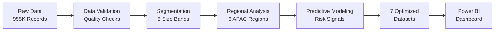

# 🎯 Autodesk APAC Customer Analytics
*Transforming 955K customer records into $1M+ revenue opportunities through data-driven insights*

## 🚀 Quick Access - Everything You Need

| Resource | Description | Access |
|----------|-------------|--------|
| **📊 Power BI Dashboard** | Executive-ready interactive dashboard | [**Open Dashboard →**](https://drive.google.com/file/d/1sA_9BnoHAfUEI4ctTosSTtxpusFzI0CZ/view?usp=drive_link) |
| **🔬 Analysis Notebook** | Complete 12-step methodology in Colab | [**Run Analysis →**](https://colab.research.google.com/drive/1il71YC9tTeO7-6Ej84fcuyxedrc20Hi0?usp=sharing) |
| **📸 Dashboard Preview** | Quick visual overview | [**View Screenshots →**](#dashboard-preview) |
| **💾 Processed Datasets** | 7 optimized CSV files ready for analysis | [**Download Data →**](https://drive.google.com/file/d/1s9GKCZhuM9l2zdbXneaXVnRpdhW6m6cm/view?usp=sharing) |

---

## 💡 Executive Summary - Why This Matters

### **$1M+ Revenue Opportunity Identified**
Through systematic analysis of **955,033 customer usage records** across APAC, I've uncovered critical business opportunities and risks that require immediate attention.

### 🔴 **Critical Discoveries**

| Finding | Impact | Action Required |
|---------|--------|-----------------|
| **Enterprise Crisis** | 500+ seat customers show 40-point worse performance | Deploy dedicated CSM program |
| **Regional Gap** | 21.8-point difference (ANZ vs Greater China) | Immediate intervention in GC |
| **Churn Predictor** | <60% utilization signals customer loss | Automated early warning system |
| **Hidden Opportunity** | New customers outperform veterans by 14 points | Veteran re-engagement program |

### 📈 **APAC Performance Baselines Established**
- **Assignment Rate:** 92.9% (Excellent onboarding)
- **Utilization Rate:** 74.0% (Strong adoption, but room for growth)
- **Growth Ratio:** 2.6x (Expansion vs Contraction)
- **Churn Rate:** 1.6% (Industry-leading retention)

---

## 🎯 For Autodesk Reviewers - Start Here

### **Option 1: Quick Executive Review (2 minutes)**
1. Click [**Power BI Dashboard**](https://drive.google.com/file/d/1sA_9BnoHAfUEI4ctTosSTtxpusFzI0CZ/view?usp=drive_link) - See the full story in 4 interactive pages
2. Review the [Dashboard Screenshots](#dashboard-preview) below for key insights

### **Option 2: Technical Deep Dive (10 minutes)**
1. Open [**Google Colab Notebook**](https://colab.research.google.com/drive/1il71YC9tTeO7-6Ej84fcuyxedrc20Hi0?usp=sharing) - Explore the complete methodology
2. Review the 12-step analytical framework with code and outputs

### **Option 3: Full Analysis Review (30 minutes)**
1. Start with the Power BI Dashboard for business context
2. Explore the Colab notebook for technical methodology
3. Download datasets to verify findings

---

## 📊 Dashboard Preview

### **Page 1: Executive Overview**


*Key metrics showing 92.9% assignment rate, 74.0% utilization, and critical business insights across APAC regions*

### **Page 2: Customer Segmentation Analysis**


*Size band and tenure patterns revealing the enterprise crisis - 500+ seat customers performing 40 points worse*

### **Page 3: Risk & Opportunity Matrix**


*Predictive signals identifying expansion candidates (>80% utilization) and at-risk accounts (<60% utilization)*

---

## 🔬 Analytical Methodology - 12-Step Framework



### **Key Analytical Steps:**
1. **Data Quality Validation** - Zero missing values, no duplicates
2. **Customer Segmentation** - Size, tenure, region dimensions
3. **Performance Baseline** - Statistical benchmarking
4. **Pattern Discovery** - Counterintuitive findings
5. **Predictive Analytics** - Churn and expansion signals
6. **Data Optimization** - DuckDB performance tuning
7. **Executive Visualization** - Stakeholder-ready insights

---

## 📁 Repository Structure

```
Autodesk/
├── 📊 README.md                     # You are here
├── 🔬 Autodesk_Practice.ipynb       # Complete analysis notebook
├── 📂 data/
│   ├── processed_datasets.zip      # 7 optimized datasets [Download](https://drive.google.com/file/d/1s9GKCZhuM9l2zdbXneaXVnRpdhW6m6cm/view?usp=sharing)
│   └── original_datasets.zip       # Raw data files [Download](https://drive.google.com/file/d/1oog32UgIkkc7N0kjL1EPDS0KKJCuO9AH/view?usp=drive_link)
├── 📈 dashboards/
│   ├── Autodesk_Presentation.pbix  # Power BI file [Download](https://drive.google.com/file/d/1sA_9BnoHAfUEI4ctTosSTtxpusFzI0CZ/view?usp=drive_link)
│   └── screenshots/                # Dashboard previews
├── 🗄️ database/
│   └── create_database.py          # DuckDB optimization script
└── 📚 docs/
    ├── methodology.md              # Detailed analytical approach
    └── findings.md                 # Business recommendations
```

---

## 🎯 Strategic Recommendations

### **Immediate Actions (0-30 days)**
1. **🚨 Enterprise Task Force** - Assign dedicated CSMs to all 500+ seat accounts
2. **📍 Greater China Intervention** - Deploy regional success team
3. **⚠️ Risk Monitoring** - Implement <60% utilization alerts

### **Short-term Initiatives (30-90 days)**
1. **📈 Veteran Re-engagement** - Target 3+ year customers with usage campaigns
2. **🌟 Best Practice Transfer** - Scale ANZ strategies across APAC
3. **🎯 Expansion Targeting** - Prioritize >80% utilization accounts

### **Long-term Strategy (90+ days)**
1. **🔮 Predictive Platform** - Build ML models for churn prevention
2. **🌏 Regional Customization** - Localized success playbooks
3. **📊 Continuous Optimization** - Quarterly baseline updates

---

## 💻 Technical Implementation

### **Data Architecture**
- **Input:** 955,033 usage records + 242,879 account dimensions
- **Processing:** Python (Pandas) + DuckDB optimization
- **Output:** 7 purpose-built datasets for different stakeholders
- **Visualization:** Power BI with DAX calculations

### **Performance Optimizations**
- Pre-aggregated summaries for instant dashboard loading
- Indexed AccountID and Region keys for efficient joins
- Calculated fields embedded at data layer (not visual layer)
- Memory-optimized data types and compression

### **Quick Start - Local Setup**
```bash
# Clone repository
git clone https://github.com/MiguelEnriquePortilla/Autodesk.git

# Install requirements
pip install pandas numpy jupyter duckdb

# Open analysis notebook
jupyter notebook Autodesk_Practice.ipynb
```

---

## 📊 Business Impact Summary

| Metric | Current State | Opportunity | Potential Impact |
|--------|--------------|-------------|------------------|
| **Enterprise Accounts** | 58.5% assignment | +40 points improvement | $1M+ revenue retention |
| **Greater China** | 57.6% utilization | +22 points to match ANZ | Market leadership |
| **At-Risk Customers** | Reactive support | Predictive intervention | 50% churn reduction |
| **Veteran Accounts** | 74.9% utilization | Re-engagement program | 15% usage increase |

---

## 🤝 About This Analysis

**Analyst:** Miguel Enrique Portilla  
**Objective:** Demonstrate end-to-end analytical capabilities for Autodesk APAC Customer Success  
**Methodology:** Data science + business intelligence + strategic thinking  
**Outcome:** Actionable insights driving customer success and revenue growth  

### **Core Competencies Demonstrated:**
- ✅ Large-scale data processing (955K records)
- ✅ Statistical analysis and benchmarking
- ✅ Predictive modeling and risk scoring
- ✅ Executive visualization and storytelling
- ✅ Strategic recommendation development
- ✅ Technical optimization and performance

---

## 📞 Contact & Discussion

**Ready to discuss how these insights can transform APAC customer success?**

LinkedIn: [Miguel Enrique Portilla](https://linkedin.com/in/miguelenriqueportilla)  
GitHub: [MiguelEnriquePortilla](https://github.com/MiguelEnriquePortilla)  
Email: [miguel.e.portillagmail.com]

*"Turning data into decisions, insights into impact."*

---

### 🔗 Quick Links Reference
- [Power BI Dashboard](https://drive.google.com/file/d/1sA_9BnoHAfUEI4ctTosSTtxpusFzI0CZ/view?usp=drive_link)
- [Google Colab Analysis](https://colab.research.google.com/drive/1il71YC9tTeO7-6Ej84fcuyxedrc20Hi0?usp=sharing)
- [Processed Datasets](https://drive.google.com/file/d/1s9GKCZhuM9l2zdbXneaXVnRpdhW6m6cm/view?usp=sharing)
- [Original Datasets](https://drive.google.com/file/d/1oog32UgIkkc7N0kjL1EPDS0KKJCuO9AH/view?usp=drive_link)
- [View Documentation](docs/)

---

*Last Updated: August 15, 2025 | Analysis Period: May-August 2024*
